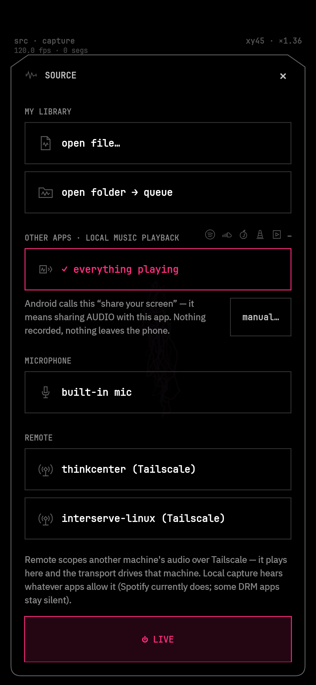
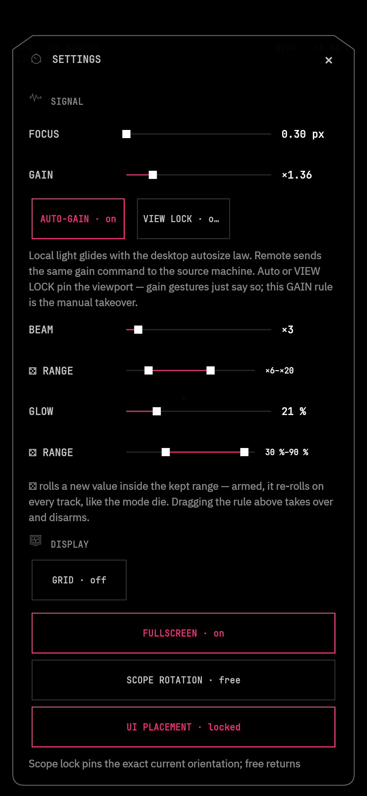

# phosphor-mobil3 · dev line

> **This is the experiment line.** Features land here first, break here first, and get fixed here first.
> Want the release everyone runs? That's **[phosphor-mobil3](https://github.com/RamenFast/phosphor-mobil3)**, the stable repo the Play Store links to.
> Want to hack on it? Read **[CONTRIBUTING.md](CONTRIBUTING.md)**. Ideas, beams, and questions go in [Discussions](https://github.com/RamenFast/phosphor-mobil3-dev/discussions).

Phosphor for Android is a CRT oscilloscope in your pocket. It brings the desktop [phosphor](https://github.com/RamenFast/phosphor) beam engine to a full-screen mobile instrument with local playback, Android playback capture, microphone input, and an optional Tailscale PC relay.

<p align="center">
  
  
</p>
<p align="center">
  
  
</p>

## What it does

- Renders the shared Rust beam engine edge to edge, with 11 scope views and 13 interface rooms.
- Plays selected files or folders as a gapless local queue with Android media controls.
- Converts audio from compatible Android apps into light after the user approves the system playback-capture prompt.
- Uses the microphone as an optional live source after runtime permission is granted.
- Connects to a user-selected PC relay over Tailscale for audio, geometry, metadata, artwork, and playback control.
- Supports portrait, landscape, multi-window, and picture-in-picture layouts.
- Stores settings locally. It has no account, ads, usage tracking, or behavior tracking. See [PRIVACY.md](PRIVACY.md).

Some protected or DRM-heavy apps prohibit playback capture and arrive as silence. Phosphor reports that limitation rather than claiming universal capture.

## Android support

- Minimum: Android 10, API 29
- Target and compile SDK: Android 16, API 36
- ABI: arm64-v8a
- Primary field device: Samsung Galaxy S25 on Android 16

The API 29 floor is compile-tested and lint-clean. Final compatibility receipts still require tests on an Android 10 or API 29 emulator and additional large-screen devices.

## Install

A release APK is valid only when it is attached to a release with checksums and signer evidence. Historical local APKs are not release candidates.

```bash
sha256sum -c SHA256SUMS
dev/pm3 --profile release --serial <serial> install phosphor-mobil3-<version>.apk
```

Google Play publication is planned. Store enrollment, signing, declarations, listing assets, and review remain human gates.

## Build

The mobile JNI crate uses path dependencies from a sibling checkout of desktop phosphor.

```bash
git clone https://github.com/RamenFast/phosphor.git
git clone https://github.com/RamenFast/phosphor-mobil3.git
cd phosphor-mobil3
scripts/bootstrap-android.sh
source scripts/env.sh
./gradlew :app:testDebugUnitTest :app:lintDebug :app:assembleDebug
```

The Gradle wrapper is the sole Android build authority. The bootstrap installs JDK 21, Android SDK 36, build tools 36.0.0, NDK 28.2.13676358, and Rust Android support under the ignored `.toolchain/` directory. Native builds use the pinned Rust toolchain and `--locked` Cargo resolution.

The debug package is `dev.phosphor.mobil3.debug`. The production package is `dev.phosphor.mobil3`.

`scripts/check-play-boundary.sh schema --json` describes local source/artifact checks and their strict result schema. The manifest checks use the same build JDK and enforce exact permissions, component exposure, and foreground-service declarations. Passing this development boundary does not establish Google Play approval or replace signing/provenance gates.

### Developer CLI

`dev/pm3` is local developer tooling. It builds, installs, launches, captures receipts, and reads diagnostics. Every device operation requires an explicit serial.

```bash
dev/pm3 schema
dev/pm3 doctor --json
dev/pm3 pair <ip:port> <code>
dev/pm3 connect <ip:port>
dev/pm3 build
dev/pm3 --serial <serial> install
dev/pm3 --serial <serial> run
```

### Release signing

Release builds fail closed. Individual Gradle builds select one profile and provide that profile's five inputs outside the repository. The canonical release gate requires both independent identities at once so the direct APK and Play-upload AAB cannot share a signer:

```bash
# Ben-controlled direct release
export PHOSPHOR_SIGNING_PROFILE=production
export RELEASE_STORE_FILE=...
export RELEASE_STORE_PASSWORD=...
export RELEASE_KEY_ALIAS=...
export RELEASE_KEY_PASSWORD=...
export RELEASE_CERT_SHA256=...

# Google Play upload signing
export PHOSPHOR_SIGNING_PROFILE=play-upload
export PLAY_UPLOAD_STORE_FILE=...
export PLAY_UPLOAD_STORE_PASSWORD=...
export PLAY_UPLOAD_KEY_ALIAS=...
export PLAY_UPLOAD_KEY_PASSWORD=...
export PLAY_UPLOAD_CERT_SHA256=...
```

After explicit approval creates the exact `v2.0.0` tag on a clean tree, run:

```bash
scripts/ship-check.sh --json --only=release.bundle
```

The release gate verifies the clean mobile and sibling-engine commits, the Ben-controlled APK signer, the Play upload AAB signer, bundletool, production boundary, 16 KiB ZIP and ELF alignment, combined exact-source archive, `BUILD-MANIFEST.json`, and `SHA256SUMS`. Generated release assets land under `app/build/outputs/release-package/v2.0.0/`.

## PC relay

Install the relay on a Linux PC with `scripts/relay-install.sh`. Add the PC in the app with a Tailscale MagicDNS name, a `.ts.net` name, or a Tailscale IPv4 address in `100.64.0.0/10`.

The relay protocol currently relies on Tailscale for peer identity and transport encryption. Do not expose relay port 45777 to the public internet. Setup and protocol details are in [docs/REMOTE.md](docs/REMOTE.md) and [docs/BRIDGE.md](docs/BRIDGE.md).

## Current release ledger

- The repository now has one debug/release Android product.
- Android 10 compatibility is implemented and lint-clean.
- Playback capture requests microphone permission before projection consent when required and asks Android for the full display on Android 14 and newer.
- Saved PC relays are empty on a fresh install and remain dormant until the user selects one.
- The first public release is free. There is no dormant trial or purchase surface.
- A current signed APK/AAB, device compatibility matrix, Play Console evidence, and final on-phone release installation are still pending.
